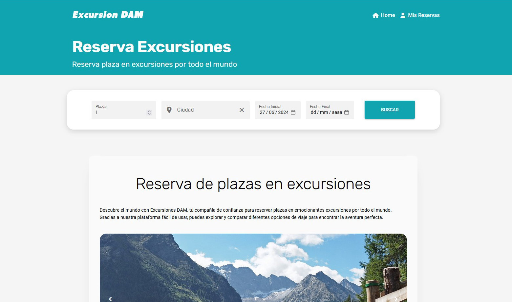
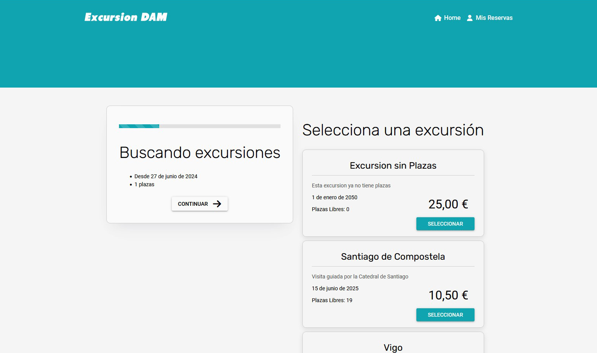
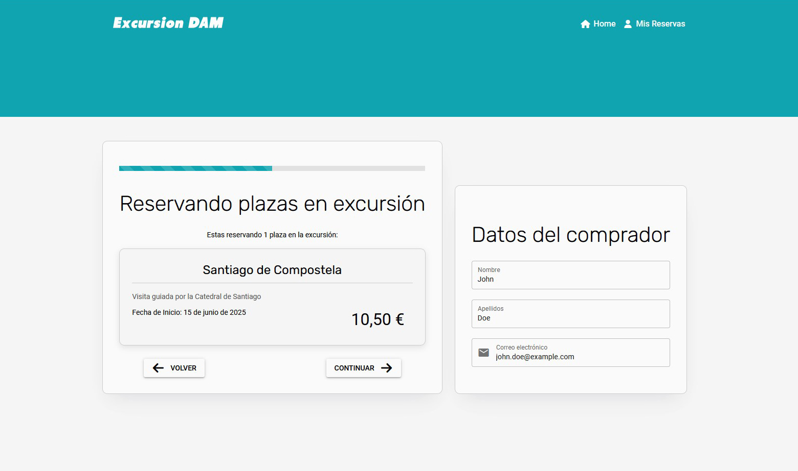
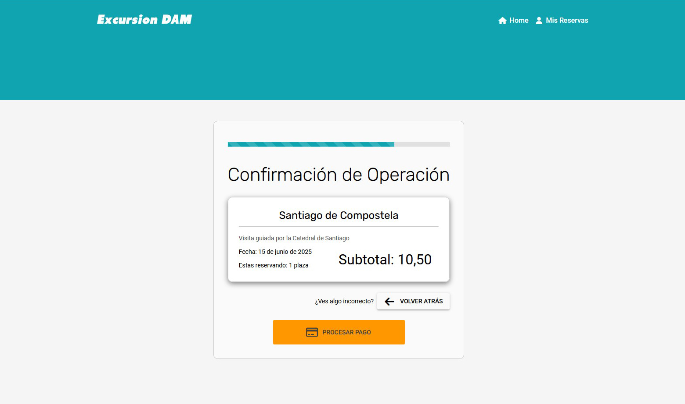
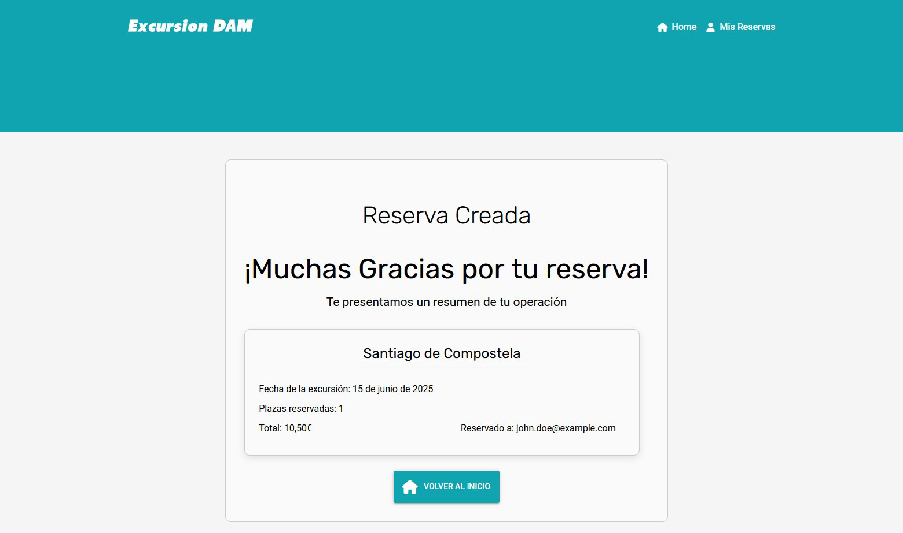
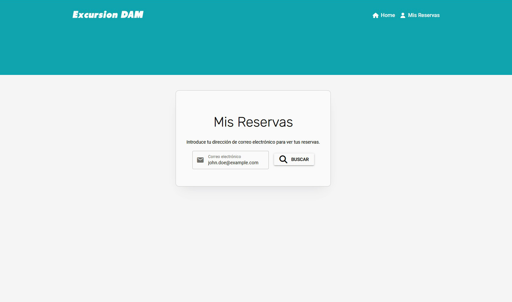

This application is a full-stack solution comprising a Spring Boot REST API for managing excursion bookings and a web frontend for users to create, retrieve, and update reservations, ensuring business constraints such as valid booking dates and seat availability.

This was my final project for class at Multiplatform Development Vocational Study.

## Replication Instructions

This application is divided in back end and front end. Each part has its own dependencies and setup. 
To replicate this project locally clone this repository and please refer to the instructions in each part's README file.

### Quick-start with Docker

If you have Docker installed on your system, you can run the whole application at once, and doesn't require a database server to be running locally.

Navigate to the location of docker-compose.yml and run:
```
docker compose up
```
Once the docker containers are up (it takes a moment), you can open in a browser http://localhost:9999 to access the frontend of the application.

The backend API is also exposed, on default port 8080

## Front End
Requires NPM

[Back End README](/pfc-front/README.md)


## Back End
Requires Java and Maven

[Front End README](/pfc-back/README.md)


## Screen shots of the application running
### Index


### Reservation Creation Process





### Look up user reservations

